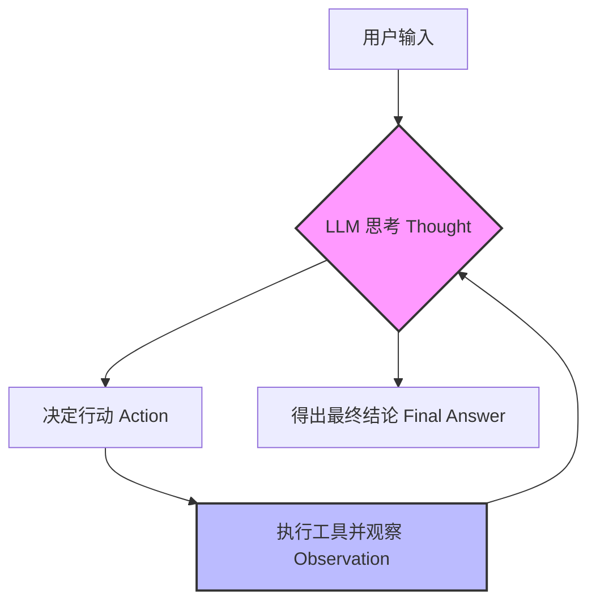

# Agent 的本质：一个简单的循环 (Loop)

在接触 LLM（大语言模型）之初，我们习惯于将其视为一个“对话框”：输入一段文字 $\rightarrow$ 等待生成 $\rightarrow$ 获得结果。但当你开始构建 **Agent（智能体）** 时，你会发现一个核心的认知转变：**Agent 的本质，其实就是一个 Loop（循环）。**

## 从 Chatbot 到 Agent

很多初学者容易把 LLM 和 Agent 混为一谈。简单来说：
- **Chatbot (聊天机器人)**：是一个**无状态**的函数。它像一个博学但没有手脚的学者，你问它问题，它凭借记忆给出答案。
- **Agent (智能体)**：是将 LLM 作为“大脑”，并为其配备“手脚”（工具）和“意识流”（循环控制）的系统。

如果 LLM 是大脑，那么 **Loop 就是这个大脑的神经反射弧**。

## 为什么 Agent 需要 Loop？

 LLM 最大的局限性在于它是一个**一次性生成**过程。一旦它开始输出，就无法在输出过程中停下来，“观察”一下现实世界，然后修正自己的答案。

而一个典型的 Agent Loop 遵循的是 **ReAct (Reason + Act)** 模式。其核心流程如下：

### 循环内部发生了什么？

1.  **Thought (思考)**：LLM 分析当前状态，决定下一步要做什么。例如：“为了回答用户的问题，我需要先知道当前目录下有哪些文件。”
2.  **Action (行动)**：LLM 调用一个外部工具（如 Bash 命令行）。它不再是生成最终答案，而是生成一个“指令”。
3.  **Observation (观察)**：系统执行该指令，并将执行结果（标准输出/错误）反馈给 LLM。
4.  **Loop (循环)**：LLM 接收到观察结果，将其加入到上下文（Context）中，再次进入 Thought 阶段。

**如果没有这个 Loop，LLM 只能通过“猜测”来模拟执行结果；有了 Loop，LLM 才能在“真实世界”中验证其假设。**

## 以 Bash 工具为例

假设我们要 Agent 完成一个任务：“寻找目录下最大的文件并告诉我它的名字”。

- **第一次循环**：
    - **Thought**: 我需要列出当前目录的文件及其大小。
    - **Action**: 执行 `ls -S`.
    - **Observation**: 得到文件列表 `[file_a, file_b, file_c]`.
- **第二次循环**：
    - **Thought**: 我已经看到了文件列表，最大的应该是 `file_a`.
    - **Action**: (无需进一步工具调用) $\rightarrow$ 生成最终答案。
    - **Final Answer**: 目录下最大的文件是 `file_a`.

在这个过程中，Agent 并不是一次性写出了答案，而是在 Loop 中通过 **“尝试 $\rightarrow$ 观察 $\rightarrow$ 修正”** 完成了任务。

## 核心思考：Loop 是 Agent 的灵魂

当我们说一个 Agent “聪明”时，往往不只是因为它使用了更强大的模型，而是因为它拥有一个更稳健的 Loop 机制：
- **容错能力**：如果 Bash 命令报错了，Loop 允许 Agent 看到错误，然后思考如何修改命令重新执行。
- **复杂任务分解**：通过 Loop，长链路的任务被分解成了无数个小步的迭代。

## 总结

学习 Agent 的第一天，最重要的一点认知就是：**不要试图通过一次完美的 Prompt 让 LLM 直接给出最终答案，而要构建一个能够自我迭代的 Loop，让 LLM 在与环境的交互中通过观察来逼近正确答案。**

Agent = LLM (大脑) + Tools (手脚) + Loop (神经反射弧)。
